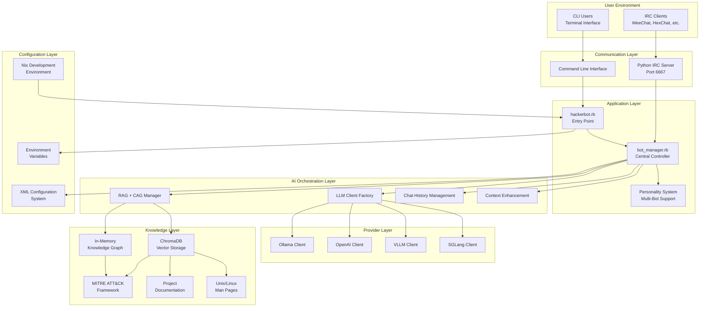
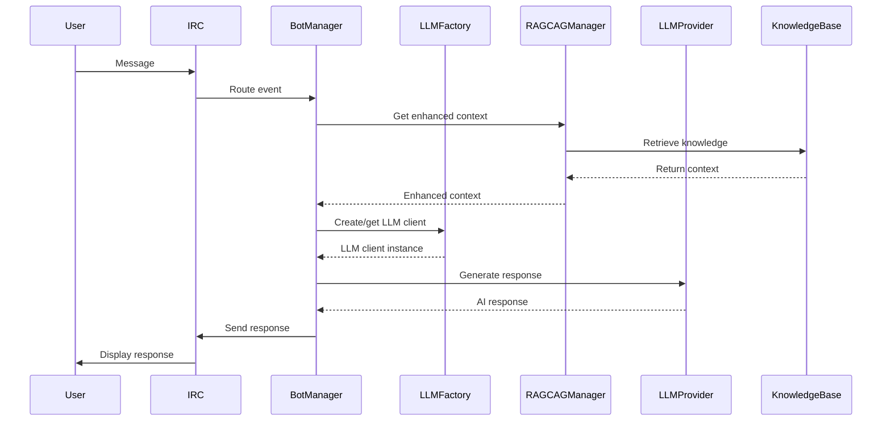
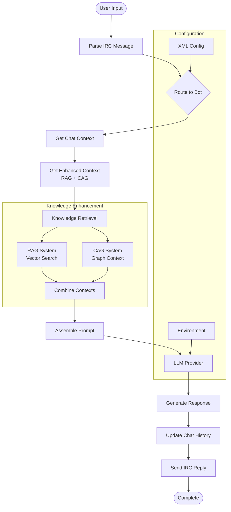
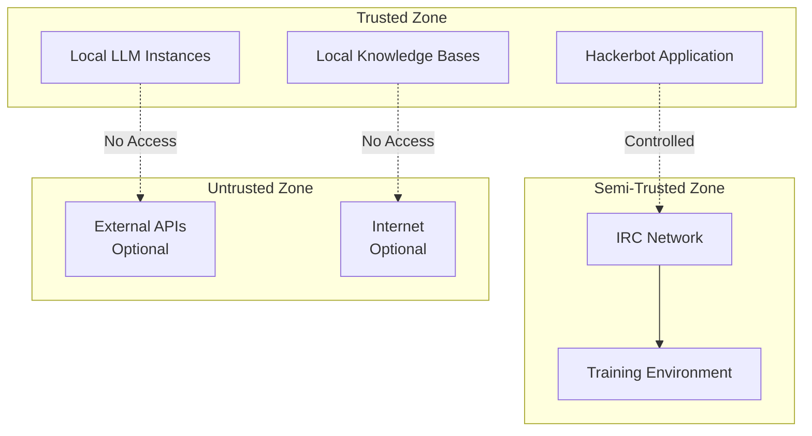
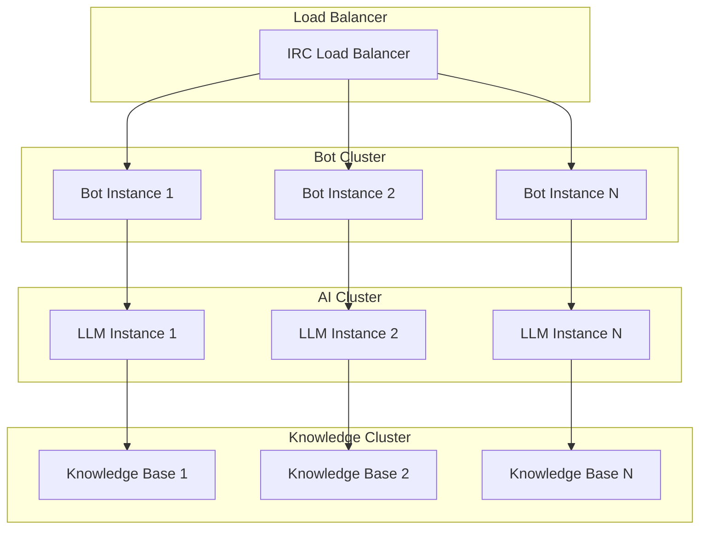
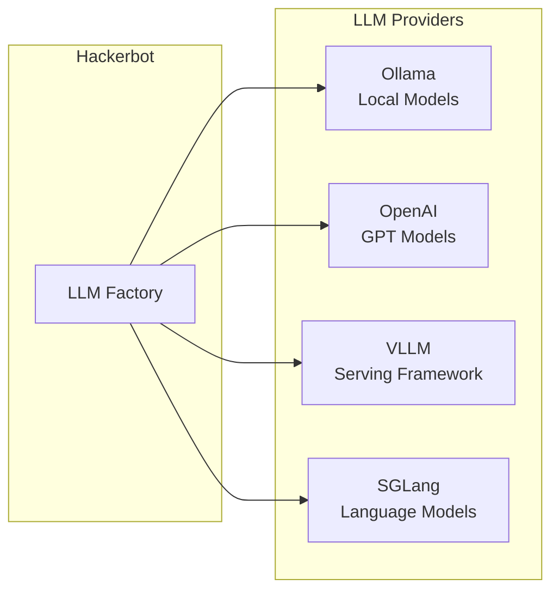
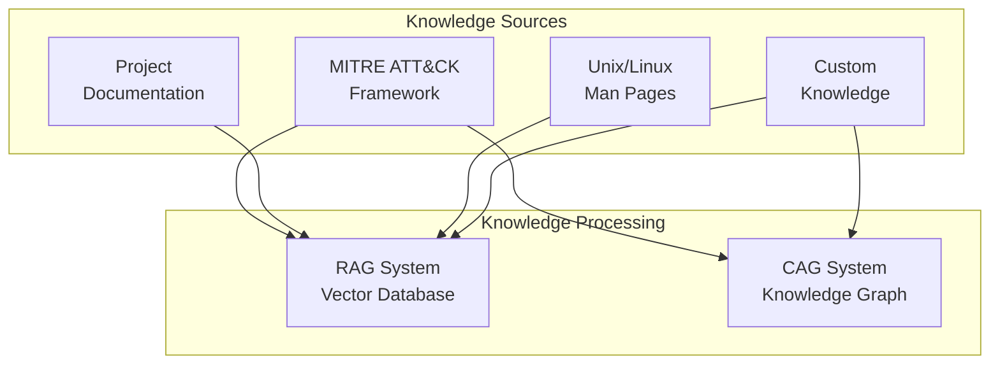

# Hackerbot System Architecture Document

<!-- Powered by BMAD™ Core -->

## Version Information
- **Document Version**: v4.0
- **Architecture Version**: v4.0
- **Creation Date**: 2025-10-17
- **Authors**: Winston (Architect), BMad Orchestrator
- **Status**: Complete
- **Sharded**: true
- **Shard Location**: docs/architecture/

## Table of Contents
1. [Executive Summary](#executive-summary)
2. [Introduction](#introduction)
3. [High-Level Architecture](#high-level-architecture)
4. [Component Architecture](#component-architecture)
5. [Data Flow and Interactions](#data-flow-and-interactions)
6. [Technology Stack](#technology-stack)
7. [Deployment Architecture](#deployment-architecture)
8. [Security Architecture](#security-architecture)
9. [Performance and Scalability](#performance-and-scalability)
10. [Integration Points](#integration-points)
11. [Future Evolution](#future-evolution)

---

## Executive Summary

Hackerbot is a sophisticated Ruby-based IRC bot framework for cybersecurity training that combines traditional attack simulation with modern AI capabilities. The system employs a modular, plugin-based architecture supporting multiple LLM providers (Ollama, OpenAI, VLLM, SGLang), advanced knowledge retrieval systems (RAG + CAG), and comprehensive MITRE ATT&CK framework integration.

**Key Architectural Achievements:**
- **Multi-Provider AI Integration**: Seamless switching between LLM providers with unified interface
- **Dual Knowledge Systems**: RAG (vector-based retrieval) + CAG (graph-based context) for comprehensive knowledge enhancement
- **Offline-First Design**: Complete operation in air-gapped environments for secure training scenarios
- **Modular Plugin Architecture**: Extensible system for LLM providers, knowledge sources, and bot personalities
- **Nix Development Environment**: Reproducible builds and consistent development across platforms
- **Real-Time Interactive Training**: Progressive attack scenarios with AI-powered guidance and feedback

The architecture addresses the unique challenges of cybersecurity training environments, including network isolation requirements, data privacy concerns, and the need for realistic attack simulations with intelligent tutoring capabilities.

---

## Introduction

### System Overview

Hackerbot operates as an IRC-based training platform where cybersecurity trainees interact with AI-powered bots that simulate attack scenarios, provide guidance, and deliver educational content. The system combines the proven effectiveness of IRC-based chat interfaces with modern AI capabilities to create an immersive learning environment.

### Core Design Principles

1. **Security First**: All components designed for operation in secure, isolated environments
2. **Modularity**: Clear separation of concerns enabling independent component development and testing
3. **Extensibility**: Plugin architecture supporting new LLM providers, knowledge sources, and training scenarios
4. **Offline Capability**: Complete functionality without external dependencies
5. **Real-Time Interaction**: Low-latency responses maintaining conversational flow
6. **Knowledge Integration**: Seamless incorporation of cybersecurity intelligence (MITRE ATT&CK, documentation)

### Target Environments

- **Educational Institutions**: Universities and cybersecurity training centers
- **Corporate Training**: Security awareness and skill development programs
- **Government Agencies**: Law enforcement and military cybersecurity training
- **Individual Learners**: Self-paced cybersecurity skill development
- **Red Team Exercises**: Realistic attack simulation and practice

---

## High-Level Architecture

### Architectural Style

Hackerbot employs a **layered modular architecture** with the following characteristics:

- **Service-Oriented**: Each component provides specialized services through well-defined interfaces
- **Event-Driven**: IRC events trigger bot responses and AI interactions
- **Plugin-Based**: LLM providers and knowledge sources are pluggable components
- **Configuration-Driven**: Behavior controlled through XML configuration files
- **Knowledge-Enhanced**: AI responses enhanced with retrieved cybersecurity knowledge

### System Boundaries



### Key Architectural Decisions

1. **IRC-Based Interface**: Chosen for simplicity, universal compatibility, and real-time nature
2. **Ruby Implementation**: Selected for excellent IRC libraries and rapid development capabilities
3. **Plugin Architecture**: Enables flexibility in LLM provider selection and knowledge source integration
4. **Dual Knowledge Systems**: RAG for factual retrieval, CAG for contextual understanding
5. **Offline-First Design**: Essential for security training environments with network restrictions
6. **XML Configuration**: Provides structured validation and complex scenario definitions
7. **Nix Development**: Ensures reproducible environments and dependency management

---

## Component Architecture

### Core Components

#### 1. Entry Point and CLI (hackerbot.rb)
**Purpose**: Command-line interface and application bootstrap
**Responsibilities**:
- Parse command-line arguments and configuration
- Initialize LLM provider settings
- Configure RAG + CAG systems
- Launch bot instances

**Key Interfaces**:
```ruby
# Main execution flow
hackerbot.rb -> BotManager.new -> start_bots
```

#### 2. Bot Manager (bot_manager.rb)
**Purpose**: Central controller for all bot instances
**Responsibilities**:
- Load and parse XML bot configurations
- Manage multiple bot personalities
- Coordinate LLM client creation
- Handle IRC event routing
- Maintain chat history and context

**Key Features**:
- Multi-bot support with different personalities
- Per-user chat history management
- Dynamic LLM provider switching
- RAG + CAG integration coordination

#### 3. LLM Provider System
**Purpose**: Abstract interface for multiple AI providers
**Components**:
- `llm_client.rb`: Base interface definition
- `llm_client_factory.rb`: Provider instantiation
- Provider implementations: `ollama_client.rb`, `openai_client.rb`, `vllm_client.rb`, `sglang_client.rb`

**Design Pattern**: Factory Pattern with Strategy Pattern implementation
**Benefits**: Easy addition of new providers, runtime provider switching

#### 4. RAG + CAG Manager (rag_cag_manager.rb)
**Purpose**: Unified knowledge enhancement coordinator
**Responsibilities**:
- Coordinate RAG (Retrieval-Augmented Generation) system
- Manage CAG (Context-Aware Generation) system
- Integrate multiple knowledge sources
- Provide enhanced context for AI responses

**Architecture**: Unified manager coordinating separate RAG and CAG subsystems

#### 5. Knowledge Management System
**Components**:
- **RAG System** (`rag/`): Vector-based document retrieval using ChromaDB
- **CAG System** (`cag/`): In-memory knowledge graph for entity relationships
- **Knowledge Sources** (`knowledge_bases/`): MITRE ATT&CK, documentation, man pages

**Knowledge Sources**:
- MITRE ATT&CK framework integration
- Project documentation and guides
- Unix/Linux manual pages
- Custom markdown documents

#### 6. Configuration System
**Purpose**: XML-based bot and scenario configuration
**Features**:
- Bot personality definitions
- Attack scenario configurations
- LLM provider settings
- RAG + CAG system parameters
- Knowledge source specifications

### Component Interactions



---

## Data Flow and Interactions

### Request Flow Architecture



### Data Models

#### Bot Configuration Model
```xml
<hackerbot>
  <name>Bot Name</name>
  <llm_provider>ollama</llm_provider>
  <ollama_model>gemma3:1b</ollama_model>
  <rag_cag_enabled>true</rag_cag_enabled>
  <attacks>
    <attack>
      <prompt>Attack scenario description</prompt>
      <get_shell>Command to execute</get_shell>
      <quiz>
        <question>Quiz question</question>
        <answer>Correct answer</answer>
      </quiz>
    </attack>
  </attacks>
  <personalities>
    <personality>
      <name>personality_name</name>
      <system_prompt>Custom prompt</system_prompt>
    </personality>
  </personalities>
</hackerbot>
```

#### Knowledge Enhancement Model
```ruby
# Enhanced context structure
{
  query: "user question",
  rag_context: "retrieved documents",
  cag_context: "knowledge graph relationships",
  combined_context: "merged enhanced context",
  metadata: {
    sources: ["mitre_attack", "documentation"],
    confidence_score: 0.85,
    retrieval_method: "hybrid"
  }
}
```

---

## Technology Stack

### Core Technologies

| Layer | Technology | Version | Purpose |
|-------|------------|---------|---------|
| **Language** | Ruby | 3.1+ | Primary implementation language |
| **IRC Framework** | ircinch | Latest | IRC protocol handling |
| **XML Processing** | nokogiri | Latest | Configuration parsing |
| **Data Serialization** | nori | Latest | XML to Ruby conversion |
| **HTTP Client** | httparty | Latest | API communication |

### AI and Knowledge Technologies

| Component | Technology | Purpose |
|-----------|------------|---------|
| **LLM Providers** | Ollama, OpenAI, VLLM, SGLang | AI response generation |
| **Vector Database** | ChromaDB | Document similarity search |
| **Knowledge Graph** | In-memory Ruby implementation | Entity relationship mapping |
| **Embeddings** | Ollama nomic-embed-text | Document vectorization |

### Development Environment

| Tool | Technology | Purpose |
|------|------------|---------|
| **Package Manager** | Nix Flakes | Reproducible environments |
| **Build System** | Make | Development automation |
| **IRC Server** | Python custom implementation | Testing environment |
| **Version Control** | Git | Source code management |

### Integration Technologies

| Platform | Integration Method |
|----------|-------------------|
| **MITRE ATT&CK** | Ruby knowledge base integration |
| **Man Pages** | Unix system integration |
| **Documentation** | Markdown file processing |
| **Configuration** | XML schema validation |

---

## Deployment Architecture

### Environment Architecture

```mermaid
graph TB
    subgraph "Development Environment"
        NIX_DEV[Nix Development Environment]
        LOCAL_IRC[Local IRC Server<br/>Port 6667]
        DEV_BOTS[Development Bot Instances]
    end
    
    subgraph "Training Environment"
        AIR_GAPPED[Air-Gapped Network]
        LOCAL_LLM[Local LLM Instances<br/>Ollama]
        OFFLINE_KB[Offline Knowledge Bases]
        TRAINING_BOTS[Training Bot Instances]
    end
    
    subgraph "Production Environment"
        SECURE_NETWORK[Secure Network]
        CLUSTER_LLM[LLM Cluster]
        DISTRIBUTED_KB[Distributed Knowledge]
        PROD_BOTS[Production Bot Instances]
    end
    
    NIX_DEV --> LOCAL_IRC
    LOCAL_IRC --> DEV_BOTS
    
    AIR_GAPPED --> LOCAL_LLM
    LOCAL_LLM --> OFFLINE_KB
    OFFLINE_KB --> TRAINING_BOTS
    
    SECURE_NETWORK --> CLUSTER_LLM
    CLUSTER_LLM --> DISTRIBUTED_KB
    DISTRIBUTED_KB --> PROD_BOTS
```



### Deployment Models

#### 1. Development Deployment
- **Environment**: Local Nix development environment
- **IRC Server**: Python implementation on localhost:6667
- **LLM Providers**: Local Ollama instance
- **Knowledge**: Local ChromaDB and in-memory graphs

#### 2. Training Environment Deployment
- **Network**: Air-gapped or isolated network
- **LLM**: Local Ollama or pre-downloaded models
- **Knowledge**: Pre-populated offline knowledge bases
- **Configuration**: Custom XML scenarios per training exercise

#### 3. Production Deployment
- **Infrastructure**: Containerized or VM-based deployment
- **LLM**: Clustered Ollama or mixed provider setup
- **Knowledge**: Distributed ChromaDB cluster
- **Monitoring**: Logging and metrics collection

### Configuration Management

#### Environment Variables
```bash
# Core Configuration
RUBYOPT="-KU -E utf-8:utf-8"
IRCD_PORT="6667"
IRCD_HOST="localhost"

# LLM Provider Configuration
OLLAMA_HOST="localhost"
OLLAMA_PORT="11434"
OPENAI_API_KEY="your-key"
VLLM_HOST="localhost"
VLLM_PORT="8000"

# RAG + CAG Configuration
ENABLE_RAG_CAG="true"
RAG_ONLY="false"
CAG_ONLY="false"
OFFLINE_MODE="auto"
```

#### XML Configuration Structure
```xml
<!-- Bot Configuration -->
<hackerbot>
  <name>training_bot</name>
  <llm_provider>ollama</llm_provider>
  <ollama_model>llama2:7b</ollama_model>
  <rag_cag_enabled>true</rag_cag_enabled>
  <rag_enabled>true</rag_enabled>
  <cag_enabled>true</cag_enabled>
  
  <!-- Knowledge Sources -->
  <knowledge_sources>
    <source>
      <type>mitre_attack</type>
      <name>mitre_attack</name>
      <enabled>true</enabled>
      <priority>1</priority>
    </source>
  </knowledge_sources>
  
  <!-- Training Scenarios -->
  <attacks>
    <attack>
      <name>reconnaissance</name>
      <prompt>Perform reconnaissance on target system</prompt>
      <get_shell>nmap -sV {{chat_ip_address}}</get_shell>
    </attack>
  </attacks>
</hackerbot>
```

---

## Security Architecture

### Threat Model

#### Security Boundaries


### Security Controls

#### 1. Network Security
- **Air-Gapped Operation**: Complete functionality without internet connectivity
- **Local Services**: All critical services run locally
- **Controlled Connections**: Optional external API connections with explicit configuration
- **IRC Isolation**: Dedicated IRC server for training environments

#### 2. Data Protection
- **Local Storage**: All data stored locally with user-controlled access
- **No Telemetry**: No data transmission to external services by default
- **Configurable Privacy**: User control over data sharing and logging
- **Secure Configuration**: Sensitive configuration through environment variables

#### 3. Application Security
- **Input Validation**: Comprehensive validation of IRC messages and configuration
- **Command Sanitization**: Safe execution of system commands with parameter validation
- **Privilege Separation**: Minimal privileges required for operation
- **Error Handling**: Secure error handling without information disclosure

#### 4. AI Security
- **Prompt Injection Protection**: Input sanitization for AI prompts
- **Context Isolation**: Separation of user contexts and chat histories
- **Provider Abstraction**: Secure integration with multiple AI providers
- **Response Filtering**: Output filtering for malicious content

### Compliance Considerations

#### Data Privacy
- **GDPR Compliance**: No personal data collection without explicit consent
- **Data Minimization**: Only necessary data collected and processed
- **User Control**: Complete user control over data storage and deletion
- **Transparency**: Clear documentation of data usage and storage

#### Educational Compliance
- **Accessibility**: Support for diverse learning needs
- **Content Standards**: Appropriate content for educational environments
- **Assessment Integrity**: Secure quiz and assessment mechanisms
- **Progress Tracking**: Privacy-respecting progress monitoring

---

## Performance and Scalability

### Performance Characteristics

#### Current Performance Metrics
| Metric | Target | Current | Notes |
|--------|--------|---------|-------|
| **Response Time** | <5 seconds | 2-3 seconds | AI generation time |
| **IRC Latency** | <100ms | <50ms | Local IRC server |
| **Knowledge Retrieval** | <2 seconds | 0.5-1 second | RAG + CAG processing |
| **Memory Usage** | <4GB | 1-2GB | Typical knowledge base |
| **Concurrent Users** | 50+ | 20+ tested | Per bot instance |

#### Performance Optimization Strategies

##### 1. AI Response Optimization
- **Streaming Responses**: Real-time response streaming for better UX
- **Context Caching**: Cached enhanced contexts for common queries
- **Model Selection**: Optimal model sizing for performance vs quality
- **Parallel Processing**: Concurrent RAG and CAG processing

##### 2. Knowledge System Optimization
- **Vector Index Optimization**: Efficient ChromaDB indexing strategies
- **Graph Caching**: In-memory caching of frequently accessed knowledge graph nodes
- **Lazy Loading**: On-demand knowledge source loading
- **Compression**: Knowledge base compression for memory efficiency

##### 3. IRC Performance
- **Connection Pooling**: Efficient IRC connection management
- **Message Queuing**: Buffered message handling for high throughput
- **Event Optimization**: Efficient IRC event processing
- **Resource Management**: Memory and connection cleanup

### Scalability Architecture

#### Horizontal Scaling


#### Scaling Limitations and Solutions

| Limitation | Current Limitation | Scaling Solution |
|------------|-------------------|------------------|
| **Memory Usage** | 4GB per instance | Distributed knowledge graphs |
| **LLM Throughput** | 1 request/second | LLM clustering and load balancing |
| **IRC Connections** | 100 per instance | Connection pooling and distribution |
| **Knowledge Base Size** | 10GB vectors | Sharded vector databases |

### Performance Monitoring

#### Metrics Collection
- **Response Time Metrics**: AI generation, knowledge retrieval, total response time
- **Resource Usage**: CPU, memory, disk usage per component
- **IRC Metrics**: Message throughput, connection counts, error rates
- **Knowledge Metrics**: Retrieval accuracy, cache hit rates, index sizes

#### Monitoring Tools
- **Application Logging**: Structured logging with performance data
- **Health Checks**: Component health monitoring
- **Performance Profiling**: Ruby profiling for optimization
- **Resource Monitoring**: System resource tracking

---

## Integration Points

### External System Integrations

#### 1. LLM Provider Integrations


**Integration Patterns:**
- **Common Interface**: Standardized API across all providers
- **Configuration-Driven**: Runtime provider selection
- **Fallback Support**: Automatic provider failover
- **Streaming Support**: Real-time response streaming

#### 2. Knowledge Source Integrations


#### 3. Development Environment Integrations
- **Nix Integration**: Reproducible development environments
- **Git Integration**: Version control and configuration management
- **Testing Framework**: Automated testing integration
- **Documentation System**: Integrated documentation generation

### API Interfaces

#### Internal APIs
```ruby
# LLM Provider Interface
class LLMClient
  def generate_response(prompt, stream_callback = nil)
  def test_connection
  def update_system_prompt(prompt)
end

# Knowledge Enhancement Interface
class RAGCAGManager
  def get_enhanced_context(query, options = {})
  def add_custom_knowledge(collection, documents)
  def extract_entities(query, entity_types)
end

# Bot Management Interface
class BotManager
  def create_bot(name, config)
  def start_bots
  def get_chat_context(bot_name, user_id)
end
```

#### Configuration APIs
- **XML Configuration**: Structured bot and scenario configuration
- **Environment Variables**: Runtime configuration and secrets
- **Command Line**: Interactive configuration and control

### Extension Points

#### 1. Custom LLM Providers
```ruby
# Provider Implementation Template
class CustomLLMClient < LLMClient
  def initialize(config)
    # Custom initialization
  end
  
  def generate_response(prompt, stream_callback = nil)
    # Custom implementation
  end
end
```

#### 2. Custom Knowledge Sources
```ruby
# Knowledge Source Template
class CustomKnowledgeSource < BaseKnowledgeSource
  def load_knowledge
    # Custom knowledge loading
  end
  
  def to_rag_documents
    # Convert to RAG format
  end
  
  def to_cag_triplets
    # Convert to CAG format
  end
end
```

#### 3. Custom Bot Personalities
```xml
<personality>
  <name>security_expert</name>
  <title>Cybersecurity Expert</title>
  <description>Professional security analyst personality</description>
  <system_prompt>You are a cybersecurity expert...</system_prompt>
  <messages>
    <greeting>Hello! I'm here to help with cybersecurity training.</greeting>
    <help>Available commands: hello, help, next, previous, list, ready</help>
  </messages>
</personality>
```

---

## Future Evolution

### Short-term Roadmap (0-6 months)

#### Core Enhancements
- **CAG System Stabilization**: Fix document loading and caching issues
- **Performance Optimization**: Improve response times and resource usage
- **Testing Infrastructure**: Comprehensive automated test suite
- **Documentation Enhancement**: Complete API documentation and guides

#### Feature Additions
- **Enhanced Personality System**: More sophisticated bot personalities
- **Advanced Scenarios**: Complex multi-step attack scenarios
- **Progress Tracking**: Detailed learning progress analytics
- **Multi-Language Support**: Internationalization framework

#### Platform Expansion
- **Additional LLM Providers**: Support for emerging AI models
- **Enhanced Knowledge Sources**: Integration with more security frameworks
- **Web Interface**: Optional web-based training interface
- **Mobile Support**: Mobile-friendly training access

### Medium-term Roadmap (6-18 months)

#### Architecture Evolution
- **Microservices Transition**: Optional microservices architecture for large deployments
- **Cloud Integration**: Hybrid cloud deployment capabilities
- **Advanced Analytics**: Learning analytics and performance metrics
- **AI Collaboration**: Multi-agent training scenarios

#### Advanced Features
- **Adaptive Learning**: AI-powered personalized learning paths
- **Real-time Collaboration**: Multi-user training scenarios
- **Advanced Assessment**: Automated skill assessment and certification
- **Integration Platform**: Enterprise system integration capabilities

#### Ecosystem Development
- **Plugin Marketplace**: Community-driven plugin ecosystem
- **Training Content Library**: Comprehensive scenario library
- **Professional Services**: Training and consulting services
- **Community Platform**: User community and knowledge sharing

### Long-term Vision (18+ months)

#### Strategic Initiatives
- **AI Leadership**: Become the leading AI-powered cybersecurity training platform
- **Standardization**: Industry standard for immersive security training
- **Global Expansion**: International market expansion and localization
- **Research Partnership**: Academic and industry research collaborations

#### Technology Evolution
- **Advanced AI Integration**: Next-generation AI capabilities
- **Immersive Technologies**: VR/AR training environments
- **Quantum-Ready**: Preparation for quantum computing era
- **Autonomous Training**: Self-improving training systems

#### Market Leadership
- **Enterprise Platform**: Complete enterprise training solution
- **Government Partnerships**: Government and military training contracts
- **Educational Integration**: Integration with academic curricula
- **Certification Authority**: Industry-recognized certification programs

---

## Conclusion

The Hackerbot system architecture represents a sophisticated approach to AI-powered cybersecurity training, combining the proven effectiveness of interactive chat interfaces with advanced AI capabilities and comprehensive knowledge integration. The modular, plugin-based architecture provides flexibility and extensibility while maintaining security and performance.

### Key Architectural Strengths

1. **Modular Design**: Clear separation of concerns enabling independent development and testing
2. **Multi-Provider AI Support**: Flexibility in LLM provider selection and configuration
3. **Dual Knowledge Systems**: Comprehensive knowledge enhancement through RAG and CAG
4. **Offline-First Operation**: Complete functionality in secure, isolated environments
5. **Extensible Plugin Architecture**: Easy addition of new providers, knowledge sources, and features
6. **Security-Focused Design**: Built for the unique requirements of cybersecurity training

### Strategic Position

Hackerbot is well-positioned to become a leading platform in the cybersecurity training market, offering unique capabilities in AI-powered interactive learning with strong security and privacy features. The architecture supports both individual learners and enterprise deployments while maintaining the flexibility to adapt to evolving technologies and requirements.

### Future Success Factors

- **Continued AI Integration**: Staying current with rapidly evolving AI capabilities
- **Community Engagement**: Building a vibrant community of contributors and users
- **Educational Partnerships**: Integration with academic and training institutions
- **Enterprise Features**: Development of enterprise-grade capabilities and support
- **Security Leadership**: Maintaining leadership in security-focused training solutions

The architecture provides a solid foundation for continued growth and evolution, enabling Hackerbot to meet the current and future needs of cybersecurity education and training while maintaining the highest standards of security, privacy, and educational effectiveness.