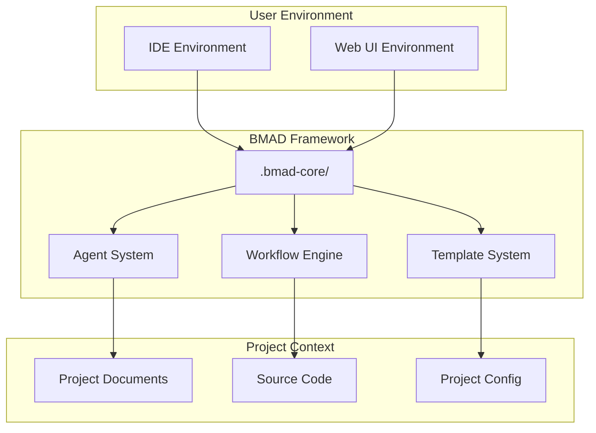
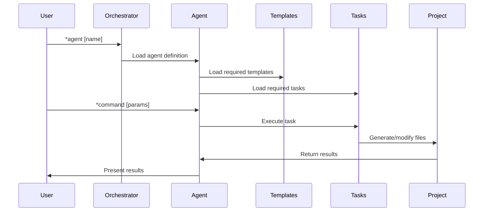
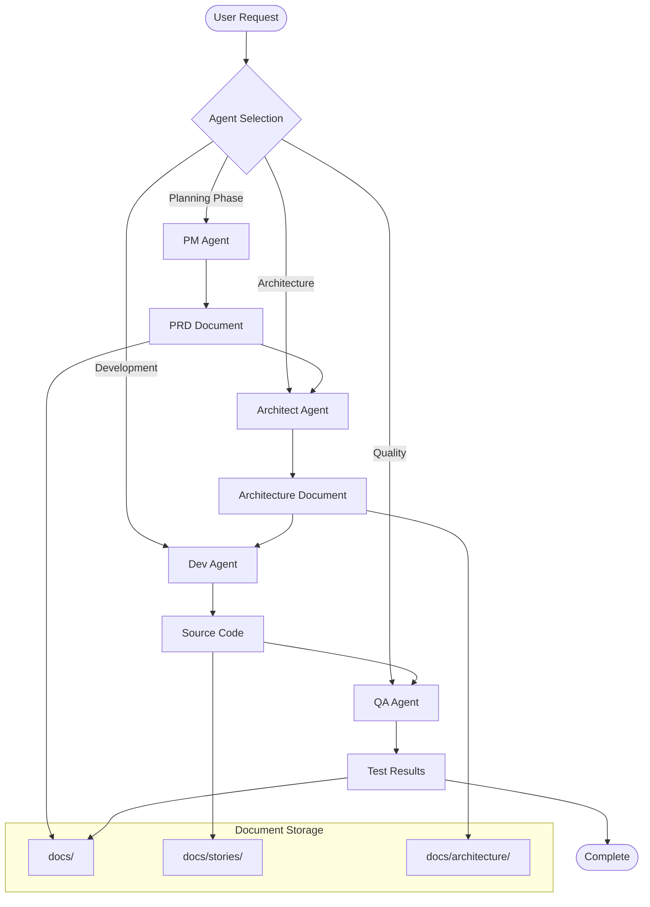
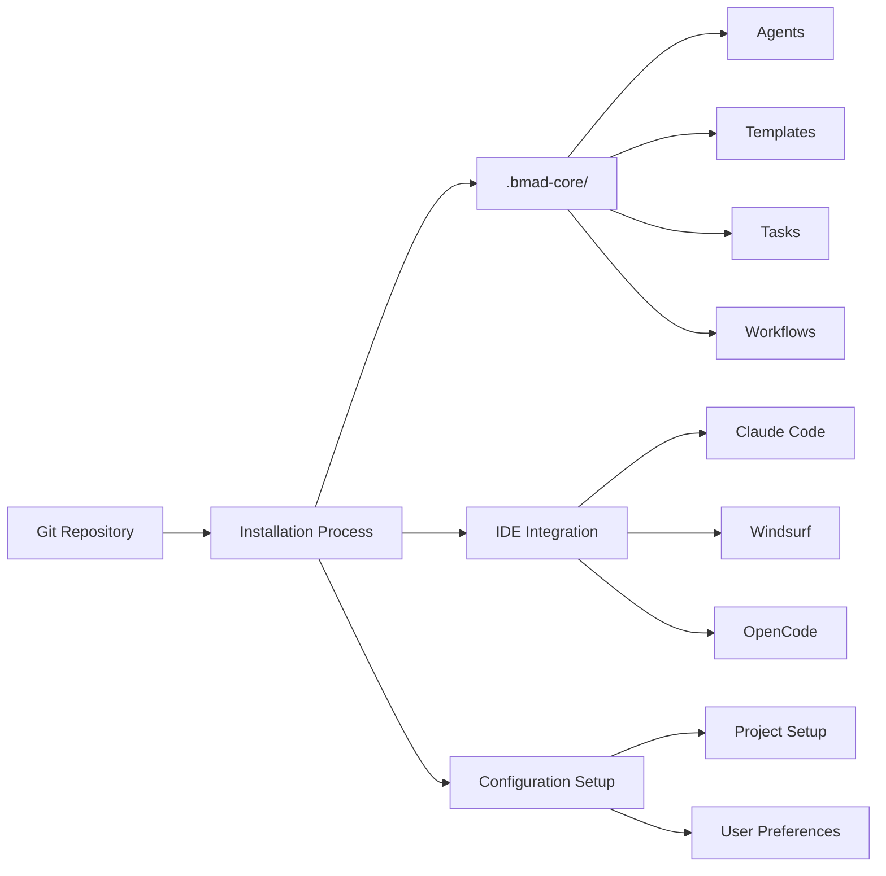

# BMAD-METHOD™ Framework Architecture Document

## Version Information
- **Document Version**: 1.0
- **Framework Version**: v4.44.1
- **Creation Date**: 2025-10-17
- **Authors**: Winston (Architect), Business Analyst, Full Stack Developer

## Table of Contents
1. [Executive Summary](#executive-summary)
2. [Introduction](#introduction)
3. [High-Level Architecture](#high-level-architecture)
4. [Component Architecture](#component-architecture)
5. [Data Flow and Interactions](#data-flow-and-interactions)
6. [Technology Stack](#technology-stack)
7. [Deployment Architecture](#deployment-architecture)
8. [Extension Points and Plugin System](#extension-points-and-plugin-system)
9. [Configuration Management](#configuration-management)
10. [Security Considerations](#security-considerations)
11. [Performance and Scalability](#performance-and-scalability)
12. [Future Evolution Roadmap](#future-evolution-roadmap)

---

## Executive Summary

BMAD-METHOD™ (Breakthrough Method of Agile AI-driven Development) is a sophisticated framework that combines specialized AI agents with Agile development methodologies. The framework operates on a "Vibe CEO" paradigm where users direct specialized AI agents through structured workflows, enabling professional-grade software development with minimal manual effort.

**Key Architectural Achievements:**
- **Modular Agent System**: 10 specialized AI roles covering the complete development lifecycle
- **Dual Environment Optimization**: Cost-effective planning (Web UI) + efficient development (IDE)
- **Document-Driven Development**: Professional artifacts (PRDs, Architecture) guide implementation
- **Context Management**: Clean agent handoffs prevent AI context overflow
- **Extensible Plugin Architecture**: Expansion packs enable domain-specific customization

The framework represents a significant advancement in AI-assisted development, providing structured workflows that bridge the gap between business requirements and technical implementation while maintaining professional quality standards.

---

## Introduction

### System Overview

BMAD-METHOD™ is built around a modular architecture centered on the `.bmad-core/` directory, which serves as the brain of the entire system. This design enables the framework to operate effectively in both IDE environments (like Cursor, VS Code) and web-based AI interfaces (like ChatGPT, Gemini).

### Core Philosophy

The framework is founded on several key principles:

1. **Agent Specialization**: Each AI agent masters one role rather than attempting to be a generalist
2. **Clean Handoffs**: Fresh context windows ensure agents stay focused and effective
3. **Document-First**: Professional artifacts guide development decisions
4. **Dual Environment Strategy**: Optimize cost and context for different development phases
5. **Extensibility**: Plugin architecture enables customization without core modifications

### Target Users

- **Solo Developers**: Seeking structure and professional output without team overhead
- **Technical Founders**: Needing rapid prototyping with investor-ready documentation
- **Development Teams**: Requiring standardized AI-enhanced workflows
- **Product Managers**: Better requirements-to-code translation

---

## High-Level Architecture

### Architectural Style

BMAD-METHOD™ employs a **modular, plugin-based architecture** with the following characteristics:

- **Service-Oriented**: Each agent provides specialized services through well-defined interfaces
- **Event-Driven**: Agent handoffs trigger workflow transitions
- **Configuration-Driven**: Behavior controlled through YAML configuration files
- **File-Based Distribution**: Simple deployment through file system operations

### System Boundaries



### Key Architectural Decisions

1. **File-Based Architecture**: Chosen for simplicity, transparency, and IDE compatibility
2. **YAML Configuration**: Provides structured data with human readability
3. **Markdown Content**: Enables rich documentation with embedded metadata
4. **Agent Specialization**: Prevents context overflow and maintains role expertise
5. **Dual Environment Support**: Optimizes cost and context for different development phases

---

## Component Architecture

### Core Components

#### 1. Agent System (`.bmad-core/agents/`)

The agent system is the heart of BMAD-METHOD™, consisting of 10 specialized AI agents:

| Agent | Role | Primary Functions | Dependencies |
|-------|------|-------------------|--------------|
| `analyst` | Business Analyst | Market research, requirements gathering | brainstorming-techniques.md, elicitation-methods.md |
| `pm` | Product Manager | PRD creation, feature prioritization | prd-tmpl.md, create-doc.md |
| `architect` | Solution Architect | System design, technical architecture | architecture-tmpl.yaml, create-doc.md |
| `dev` | Developer | Code implementation, debugging | story-dod-checklist.md, apply-qa-fixes.md |
| `qa` | QA Specialist | Test planning, quality assurance | qa-gate-tmpl.md, review-story.md |
| `ux-expert` | UX Designer | UI/UX design, prototypes | front-end-spec-tmpl.md, generate-ai-frontend-prompt.md |
| `po` | Product Owner | Backlog management, story validation | po-master-checklist.md, validate-next-story.md |
| `sm` | Scrum Master | Sprint planning, story creation | create-next-story.md, story-tmpl.md |
| `bmad-master` | Universal Expert | All capabilities without switching | All tasks and templates |
| `bmad-orchestrator` | Team Coordinator | Multi-agent workflows, role switching | workflow-management.md, all agents |

**Agent Structure:**
```yaml
agent:
  name: [Agent Name]
  id: [unique-id]
  title: [Professional Title]
  icon: [emoji]
  whenToUse: [Usage guidance]

persona:
  role: [Professional Role]
  style: [Interaction Style]
  identity: [Core Identity]
  focus: [Primary Focus]
  core_principles: [Guiding Principles]

commands:
  - [command-name]: [description]
  - ...

dependencies:
  tasks: [task-files]
  templates: [template-files]
  checklists: [checklist-files]
  data: [data-files]
```

#### 2. Template System (`.bmad-core/templates/`)

The template system provides structured document generation with variable substitution:

**Template Types:**
- **Architecture Templates**: System design documents
- **PRD Templates**: Product requirements specifications
- **Story Templates**: User story definitions
- **Frontend Templates**: UI/UX specifications
- **QA Templates**: Quality assurance documents

**Template Processing Pipeline:**
1. Parse YAML configuration
2. Process conditional sections
3. Handle interactive elicitation
4. Generate output with variable substitution
5. Apply formatting rules

#### 3. Task Engine (`.bmad-core/tasks/`)

The task engine provides executable workflows for specific activities:

**Task Categories:**
- **Document Creation**: create-doc, brownfield-create-epic
- **Story Management**: create-next-story, review-story
- **Quality Assurance**: qa-gate, apply-qa-fixes
- **Project Management**: document-project, trace-requirements
- **Development Support**: shard-doc, index-docs

#### 4. Workflow System (`.bmad-core/workflows/`)

Workflow orchestration manages end-to-end development processes:

**Workflow Types:**
- **Greenfield**: New project development
- **Brownfield**: Existing system enhancement
- **Service**: Backend/API development
- **UI**: Frontend development
- **Fullstack**: Complete application development

### Component Interactions



---

## Data Flow and Interactions

### Agent Handoff Pattern

The framework uses a clean handoff pattern to maintain context integrity:

1. **Context Isolation**: Each agent operates in a fresh context window
2. **Artifact Passing**: Information passed through structured documents
3. **State Management**: Project state maintained in file system
4. **Validation Gates**: Checkpoints ensure quality between phases

### Data Flow Architecture



### Configuration Flow

Configuration flows from multiple sources:

1. **Global Configuration**: `.bmad-core/core-config.yaml`
2. **Agent Configuration**: Individual agent YAML blocks
3. **Project Configuration**: Project-specific settings
4. **User Preferences**: Custom technical preferences

---

## Technology Stack

### Core Technologies

| Component | Technology | Version | Purpose |
|-----------|------------|---------|---------|
| **Configuration** | YAML | 1.2+ | Structured configuration data |
| **Content** | Markdown | CommonJS | Document authoring with metadata |
| **Build Tools** | Shell Scripts | POSIX | Automation and deployment |
| **Package Management** | npm (optional) | 8+ | Optional tooling |
| **Version Control** | Git | 2.30+ | Source code management |

### Integration Technologies

| Platform | Integration Method | Configuration |
|----------|-------------------|---------------|
| **Claude Code** | File copying | `.claude/commands/BMad/` |
| **Windsurf** | YAML workflows | `.windsurf/workflows/` |
| **OpenCode** | JSON configuration | `opencode.jsonc` |
| **Cursor** | File system | Direct file access |
| **GitHub Copilot** | Chat interface | Agent selection |

### Development Tools

| Category | Tool | Purpose |
|----------|------|---------|
| **Document Processing** | @kayvan/markdown-tree-parser | Document sharding |
| **Validation** | Built-in checklists | Quality assurance |
| **Debugging** | `.ai/debug-log.md` | Development logging |
| **Testing** | Manual validation | Quality control |

---

## Deployment Architecture

### Distribution Model

BMAD-METHOD™ uses a **file-based distribution** model:

1. **Core Framework**: Distributed via Git repository
2. **IDE Integration**: File copying to platform-specific directories
3. **Web UI Support**: Conceptual - agents designed for web platform compatibility
4. **Expansion Packs**: Plugin-based extensions

### Installation Architecture



### Environment Support

**Supported Environments:**
- **Linux**: Primary development environment
- **macOS**: Full support through file system compatibility
- **Windows**: Support through WSL (Windows Subsystem for Linux)

**IDE Platforms:**
- **Cursor**: Native AI integration
- **Claude Code**: Anthropic's official IDE
- **Windsurf**: Built-in AI capabilities
- **Trae**: Built-in AI capabilities
- **Cline**: VS Code extension
- **Roo Code**: Web-based IDE
- **GitHub Copilot**: VS Code extension

---

## Extension Points and Plugin System

### Expansion Pack Architecture

The framework supports extensibility through **expansion packs**:

**Pack Categories:**
- **Industry Specific**: Healthcare, finance, government
- **Technology Stacks**: Cloud platforms, frameworks
- **Process Frameworks**: Agile variants, compliance
- **Advanced Features**: AI collaboration, automation

### Extension Points

1. **Custom Agents**: Domain-specific AI agents
2. **Custom Templates**: Industry-specific document templates
3. **Custom Tasks**: Specialized workflow steps
4. **Custom Workflows**: End-to-end process definitions
5. **Custom Checklists**: Quality validation criteria

### Plugin Development

**Plugin Structure:**
```
expansion-pack/
├── agents/           # Custom agents
├── templates/        # Custom templates
├── tasks/           # Custom tasks
├── workflows/       # Custom workflows
├── checklists/      # Custom checklists
├── data/           # Reference materials
└── install.yaml    # Installation manifest
```

---

## Configuration Management

### Core Configuration

The `.bmad-core/core-config.yaml` file serves as the central configuration hub:

```yaml
# Document Configuration
markdownExploder: true
qa:
  qaLocation: docs/qa
prd:
  prdFile: docs/prd.md
  prdVersion: v4
  prdSharded: true
  prdShardedLocation: docs/prd
architecture:
  architectureFile: docs/architecture.md
  architectureVersion: v4
  architectureSharded: true
  architectureShardedLocation: docs/architecture

# Development Configuration
devLoadAlwaysFiles:
  - docs/architecture/coding-standards.md
  - docs/architecture/tech-stack.md
  - docs/architecture/source-tree.md
devDebugLog: .ai/debug-log.md
devStoryLocation: docs/stories
slashPrefix: BMad
```

### Configuration Hierarchy

1. **Global Defaults**: Built-in framework defaults
2. **Core Configuration**: Project-specific settings
3. **Agent Configuration**: Individual agent overrides
4. **User Preferences**: Personal customization
5. **Runtime Configuration**: Session-specific settings

### Configuration Validation

The framework includes validation for:
- Required file existence
- Configuration schema compliance
- Dependency resolution
- Version compatibility

---

## Security Considerations

### Data Protection

**File System Security:**
- No sensitive data stored in agent definitions
- Configuration files contain no secrets
- User data remains in project directory
- No external data transmission by default

**AI Interaction Security:**
- No hardcoded API keys or credentials
- User-controlled AI platform selection
- Context isolation between agents
- No persistent data storage in AI platforms

### Access Control

**File Permissions:**
- Standard file system permissions apply
- No elevated privileges required
- User-controlled access to project files
- No system-level modifications

**Agent Security:**
- Agents operate within defined boundaries
- No file system access beyond project scope
- No network access unless explicitly required
- Command validation and sanitization

### Compliance Considerations

**Data Privacy:**
- No personal data collection
- Local processing by default
- User-controlled data sharing
- Compliance with GDPR and similar regulations

**Intellectual Property:**
- User retains all project rights
- Framework licensed under permissive terms
- No code ownership claims
- Clear attribution requirements

---

## Performance and Scalability

### Performance Characteristics

**Current Performance:**
- **Startup Time**: Sub-second agent loading
- **Memory Usage**: Minimal footprint (<10MB base)
- **File Operations**: Optimized for local file systems
- **Context Switching**: Clean handoffs prevent bloat

**Optimization Strategies:**
- Lazy loading of agent dependencies
- Caching of frequently accessed resources
- Minimal context transfer between agents
- Efficient file-based operations

### Scalability Considerations

**Current Scale:**
- **Agents**: 10 specialized roles
- **Tasks**: 25+ executable workflows
- **Templates**: 15+ document templates
- **Checklists**: 7 quality validation lists

**Scaling Limitations:**
- File-based distribution becomes limiting at scale
- Manual IDE integration process
- No automated dependency resolution
- Limited team collaboration features

**Future Scaling Solutions:**
- Database-backed configuration for enterprise
- Microservice architecture for distributed teams
- Caching layer for performance optimization
- API-based agent communication

### Performance Monitoring

**Metrics Tracked:**
- Agent loading times
- Task execution duration
- File operation performance
- Memory usage patterns

**Debugging Support:**
- Comprehensive logging to `.ai/debug-log.md`
- Error tracking and reporting
- Performance profiling capabilities
- Context window monitoring

---

## Future Evolution Roadmap

### Short-term Priorities (0-6 months)

**User Experience Enhancement:**
- Simplified onboarding process
- Interactive setup wizard
- Enhanced error messages
- Performance optimization

**Platform Expansion:**
- Additional IDE platform support
- Enhanced web UI integration
- Mobile development support
- Cloud IDE compatibility

**Developer Tools:**
- CLI tool for framework management
- Automated testing pipeline
- Debugging and profiling tools
- Hot reloading for development

### Medium-term Priorities (6-18 months)

**Enterprise Features:**
- Team management capabilities
- Advanced security controls
- Usage analytics and reporting
- Compliance frameworks

**Advanced Collaboration:**
- Multi-agent workflows
- Real-time coordination
- Shared context management
- Conflict resolution

**Platform Evolution:**
- API for programmatic access
- Plugin marketplace
- Community contribution system
- Professional services integration

### Long-term Vision (18+ months)

**Ecosystem Leadership:**
- Industry standard for AI-assisted development
- Comprehensive plugin ecosystem
- Global community and partnerships
- Research and innovation leadership

**Technology Advancement:**
- Advanced AI collaboration patterns
- Automated code generation
- Intelligent testing and deployment
- Predictive development analytics

**Market Expansion:**
- Enterprise-grade solutions
- Educational partnerships
- Government and regulated industries
- International expansion

---

## Conclusion

The BMAD-METHOD™ framework represents a sophisticated approach to AI-assisted software development, combining the strengths of specialized AI agents with proven Agile methodologies. The modular architecture, dual-environment support, and extensible plugin system provide a solid foundation for current needs while enabling future growth and evolution.

**Key Strengths:**
- Comprehensive agent specialization covering the entire development lifecycle
- Document-driven approach ensuring professional quality
- Clean architecture enabling maintainability and extensibility
- Cost-effective optimization across different development phases
- Strong foundation for future enhancement and scaling

**Strategic Position:**
The framework is well-positioned to become a leader in the AI-assisted development space, with clear differentiation through agent specialization and structured workflows. The open-source core with commercial expansion packs provides a sustainable business model while encouraging community growth and innovation.

**Future Success Factors:**
- Continued focus on user experience and simplification
- Expansion of platform support and integrations
- Development of enterprise-grade features
- Cultivation of a vibrant plugin ecosystem
- Leadership in AI-assisted development research and innovation

The BMAD-METHOD™ framework architecture provides a solid technical foundation for revolutionizing how software development is performed in the age of AI, enabling both individuals and teams to achieve professional results with unprecedented efficiency and consistency.